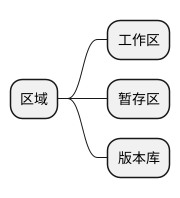
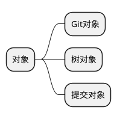

# git 新版笔记(尚硅谷)

## 1. 初始化

```bash
git config --global user.name "userName"
git config --global user.email "user@example.com"
git config --list
```

## 2. 区域

1. 工作区: 相当于沙盒，git不会管理
2. 暂存区: 增删改的缓存
3. 版本库: 提交到版本库

## 3. 对象

