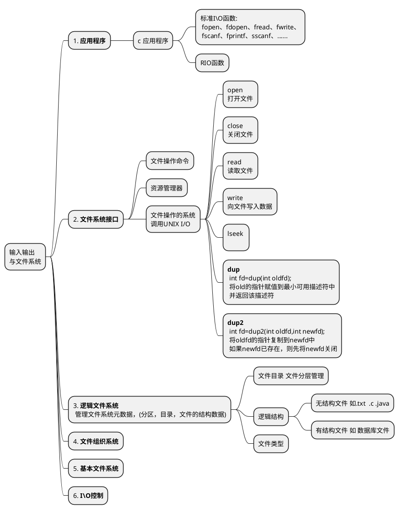

# 期末复习

## 1. 输入输出与文件系统

* 常见函数:
	 lseek 函数

## 2. 进程控制

1. 子进程是从fork() 才开始运行的
2. 一次调用 wait() 或 waitpid() 只能回收一个子进程 ，多个的话需要用到循环
3. **中断**: 在CPU执行程序的过程中,出现了某种<s>紧急</s>或<s>异常</s>的事件(如网卡数据到达、电源掉电、运算溢出), CPU将暂停正在执行的程序，转去执行中断服务程序处理该事件，并在处理完毕后返回断点处继续执行被暂停的程序，这一过程称为中断
4. **中断机制**: CPU有专门用于处理中断的硬件单元，称为**中断机制**
5. **信号机制**: 信号机制是在进程层面对cpu中断机制的一种模拟
6. **signal函数**: 将信号交给自定义函数处理
7. **alarm函数**: 在特定秒数后返回一个SIGALRM信号  `unsigned int alarm(unsigned int seconds)`
8. **kill函数**: 传信号给制定的进程 `int kill(pid_t pid, int sig);`
	* pid $<0$  给进程组为-pid的进程
	* pid $>0$  将洗好给指定pid进程
	* pid $=0$  将信号传给同组进程
	* pid $=-1$ 将信号广播给系统所有进程 除了init进程;
9. 进程的三个状态
	* **就绪**: 进程已分配到除CPU以外的所有必要资源，只要获得CPU，便可立即执行，该状态为就绪状态
	* **阻塞**: 进程已包括CPU在内的**所有**运行所需资源，正在执行中
	* **运行**: 正在执行的进程因请求资源、等待**事件发生**、**等待I/O**等原因，而暂时无法继续执行时，进入阻塞状态

10. 进程或线程之间通信
	1. **管道(无名管道)**:
		* int fds[2] ;   pipe(fds);  fds[0]用于读取， fds[1]用于写入
	2. **FIFO(命名管道)**:
		* 只适合单向通信,如果要双向通信，建立两个管道
		* 终端用 mkfifo [管道名]  c程序中用 mkfifo("[管道名]",[权限模式(如: 0777))]);
	2. **消息队列**:
	3. **信号量**:
	4. **共享内存区**:

## 3. 内存
### 3.1 内存和cache之间的映射
1. **直接相连映射**: 每个主存块映射到cache的固定行
	* 将cache分为 **n** 块 每块 **x** 大小, 则若主存总共有有 **y** 大小 分为 **y/x**  个块  有 **y/x/n** 个组
	* 例如  有8k 大小的cache 每块512字节  主存大小为1M    则cache有8k/512=16个组   主存有1M/512= 2k 个块,主存分为2k/16=128 组
	* 优点： 算法简单，容易实现，命中时间短,无需考虑替换问题
	* 缺点： 命中率低,空间利用率低
2. **全相连映射**: 每个主存块映射到cache的任一行
	* 主存中的任何一块都能映射到cache中的任何一块
3. **组相连映射**: 每个主存块映射到cache固定组的任一行(是上面两种方法的折中)
	* 主存 地址拆分后的主存组内地址和cache的组号相对应
	* 例如  有8k 大小的cache 每块512字节采用两路组相连映射  主存大小为1M    则cache有8k/512=16个块  分为16/2=8组   主存有1M/512= 2k 个块,主存分为2k/8(cache的组的个数)=256 组
4. 算法:
	* FIFO (first-in-first-out) 先进先出
	* LRU (least-recently used) 最近少用
	* LFU (least-frequently used) 最近不常用
	* Random 随机算法

### 3.2 虚拟存储器
* 思想
	* 在不受物理内存限制的虚拟空间中写程序 IA-32 大小为 2^32 B (写程序)
	* 程序执行过程中，把当前执行道德一部分或者全部数据调用到主存中(运行程序时)
	* 借用部分外村当做逻辑上的内存(实质)

* MMU 地址转换功能(cpu内置功能)
	* cpu给出程序地址( **VA** `virtual address` 虚拟地址或者逻辑地址) 通过  **MMU** 转换为 ( **PA** `physical address` 物理地址)
	* MMU 功能:
		* 地址转换 VA -> PA
		* 检查访问信息是否在主存，不在则由操作系统再出到主存
		* 检查是否越界
		* 检查权限

* 分页管理
	* 虚拟地址 VA (`virtual address`)
		* 虚拟页 VP (`virtual page`)
	* 物理地址 PA(`virtual address`)
		* 主存中的 **页** 称为页框(页帧) PF(page frame)  或 PP(physical page)
	* 建立逻辑页和物理页的关系称为 **页表**

* 局限性:
	* 时间局部性:
		* 通过快表 TLB
	* 空间局部性
		* 通过多重页表

## 4 cpu 调度
* 调度算法的评价指标
	1. cpu 利用率
	2. 系统的吞吐量
		* 单位时间完成的作业量
	3. 周转时间
		* 平均周转时间: 各作业时间之和/作业数
		* 带权周转时间: 作业周转时间/作业运转时间
		* 平均带权周转时间: 各种带权周转时间之和/作业数
	4. 等待时间
		* 平均等待时间
	5. 响应时间
		* 指用户提出请求得到响应时间

