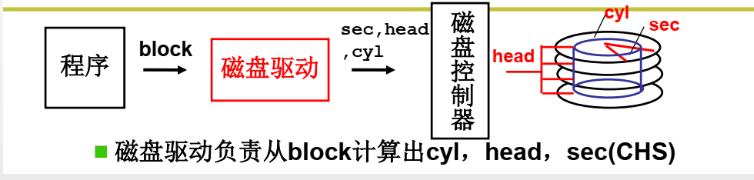
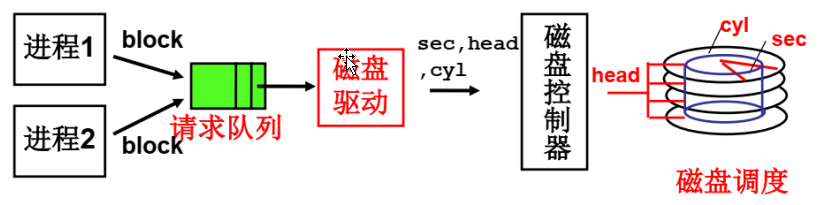
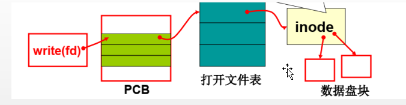
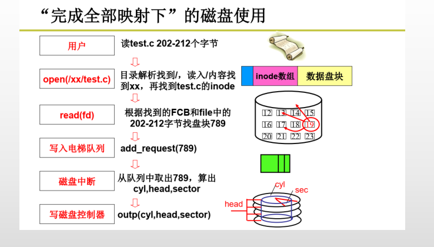
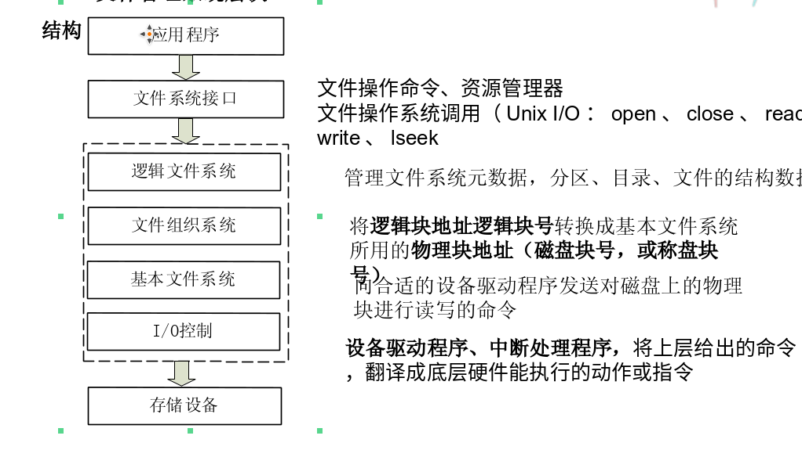

# 第一部分 文件系统的分层
## 磁盘

### **扇区**:

* 磁盘的访问单位是扇区
* 扇区的大小一般是： 512B(字节)
* 扇区的大小是 **传输文件** 和 **碎片浪费的折中**
* **总结** : 利用磁盘的三个地址(*cyl(柱面)*,*head(磁头)*,*sec(扇区号)*]**CHS**)找到位置，进行磁电感应，与缓存交换数据。 (程序直接发给控制器 硬盘位置)


## 第一层抽象: 
* 用块使用磁盘，程序发给控制器的是块号(block)，块号到硬盘地址的过程由操作系统完成
* 一个块(block) 一般由8个 **扇区** 组成



## 第二层抽象: 
* 多个线程通过 **队列** 使用磁盘


## 第三层抽象:
* 程序通过 **文件** 的抽象概念使用硬盘


* **FCB**


## 第四层抽象:
* **文件系统**
* 通过文件的*路径*得到 该文件 的 *FCB* 
* 文件系统的映射：


## 总结


* 使用流程：目录--文件--inode---块号--柱面等地址，文件名字--硬盘

<hr color=red/>

# 第二部分 文件结构

## 一.文件和文件目录概念
* **文件**： 文件为使用者提供了一个操作数据资料的统一方法、统一界面
* **文件目录**: 使用目录可对大量文件资料进行分类、分层管理	

## 二.文件的逻辑结构
* **文件逻辑结构**: 是从文件的 *使用者* 角度来看文件结构，仅与文件的 **内容** 和 **组织结构有关** <u>不涉及</u> 文件在存储设备上的组织方式
* 三种文件逻辑结构
	1. 无结构文件 : 文件的各字节对OS而言，并无特殊意义, 如 `.txt` `.cpp` `.java`
	2. 有结构文件: 文件由多条（定长或不定长）记录构成, 如 数据库文件, 手机通讯录备份文件
	3. 复杂文件结构: 用一个文件头来描述文件结构，如可执行文件结构`.exe`


## 三.文件类型

### 1.按文件内容分类及标识方法
* 用文件后缀（扩展名）来标识特定文件类型

### 2.Linux/Unix文件分类、用标记或颜色标识文件类型
* <font color=green>绿色</font>：   可执行文件
* <font color=red>红色</font>： 压缩文件
* c或<font color=DarkOrange>黄色</font>:字符设备文件
* d或<font color=blue>蓝色</font>：目录文件
* -：  普通文件
* p或<font color=DarkGoldenRod>深黄色</font>:管道文件

### 文件属性、目录项与目录
* <b>文件属性</b>： 文件建立时，文件系统自动记录创建时间、创建者、文件大小等属性。
	1. **文件一般属性**: 包括文件名、创建者、拥有者、文件大小、创建时间、最后修改时间、上次存取时间等
	2. **数据位置属性**: 存储文件内容磁盘块号
	3. **文件安全属性**: 包括文件存取权限（按用户、用户组是否可读、可写、可执行、可删除）、文件保护密码等

* <b>目录项</b>： 辅存中存储文件属性的对象，又称文件<u>**控制块**（FCB，File Control Block)</u>
* <b>文件目录</b>: 辅存中在相同路径下文件目录项组成文件目录（Linux系统下称为目录文件

### 文件逻辑位置与实际位置概念
* **文件逻辑位置(逻辑地址)**: 文件中某个字节、记录、数据块在文件中编号（字节号、逻辑记录号、数据块号，从0开始）
* **文件物理位置(物理地址)**: 文件某个字节、记录、数据块在辅存中的位置（磁盘块号，从盘快号0开始编号）

### 三种文件目录结构
1. 单级文件目录
2. 两级文件目录
	1. 一级称为主文件目录，给出用户名，用户子目录所在的物理位置
	2. 二级称为用户文件目录

3. 多级目录结构

### 文件操作实现方法
* **创建文件**、 **删除文件**
* **读文件**、 **写文件** 和 **设置文件的读写位置**
* **文件打开** 和 **关闭**
* 其他文件操作
	1. 文件搜索
	2. 文件属性设置（权限设置，…)
	3. 目录操作   (创建、删除、移动、复制）
	4. 实现文件共享操作
	5. 文件系统操作（安装、卸载)

### 文件创建实现的方法
* 用户程序调用文件创建系统调用(create)创建文件/home/can/f3过程：
	1. 根据f3大小为其分配磁盘块(如15）
	2. 在/home/can目录下为f3增加一个目录项(FCB)，填入f3的属性（包括磁盘块号）
* 文件读写操作
	1. 读文件操作read(fd,buf,len)
		1. 根据读写指针值pos和读写长度len，计算逻辑块号（逻辑地址）
		2. 将相关的数据块读到内存
		3. 从数据块中选择需要的数据复制到缓冲区buf中
	
	2. 写文件操作
		1. 根据读写指针值pos和读写长度len，计算相关数据块的逻辑块号
		2. 若第1个或最后数据块内容并非全部写入的话，需先将其读入内存
		3. 用buf中数据更新首末数据块相关字节，其他数据块内容直接取自buf
		4. 将各数据块写入磁盘

# 第三部分 输入输出与文件系统

## 文件系统管理架构

### 1.文件管理系统层次
 

### 2.文件操作库函数

* c应用程序
	* 标准I/O 函数: `fopen, fdopen, fread, fwrite, fscanf, fprintf, sscanf, sprintf, fgets, fputs, fflush, feseek, fclose`
	* RIO 函数： `rio_readn, rio_writen, rio_readlinitb, rio_readlineb, rio_readnb`

* UNIX I/O 函数
	* `open, read, write, lseek, stat, dose`
	
* 注释: 
	* **UNIX I/O**：操作系统内核中实现，可进行文件I/O、设备I/O、网络I/O等，功能强，每次调用需将控制从应用程序传递到内核，开销较大，不方便按行读取数据
	* **标准I/O库**：将一个打开的文件模型化为一个流，当输入输出数据量较小时，I/O仅从用户缓冲区读写数据，效率高，但数据写入有滞后性，一般仅适合于文件编程
	* **RIO库**：支持按行读取数据，也支持设备I/O、网络通信，可在网络编程中使用


## UNIX I/O (系统调用函数构成):
1. **open 函数**: 打开文件
	* 应用程序调用open要求内核打开相应的文件，来宣告它想要访问一个I/O设备或文件。
	* 内核返回文件描述符，一个小的非负整数，以后操作用描述符来标识该文件，内核记录有关这个打开文件的所有信息（文件属性、读写指针），应用程序只需记住这个描述符
	* 系统将自动打开键盘、正常输出窗口（屏幕）、错误输出窗口三个设备文件，返回前三个文件描述符<u><b>0、1、2</b></u>，分别称为*标准输入*、*标准输出*、*标准错误*输出

2. **lseek函数**: 改变当前文件位置
	* 每个打开文件都保持着一个读写位置，其值是从距离文件起始位置的<u>**字节**</u>偏移量
	* 新打开文件的读写位置在文件其实位置，值为0
	
3. **read函数**: 读取文件数据
	* 从文件当前读写位置传递n个字节到内存，读写指针向后移动n个字节
	* 若读写指针移动到最后一个字节之后，则触发EOF条件 返回0，错误返回-1

4. **write函数**: 向文件写入数据，并移动指针
5. **close函数**: 关闭文件，回首内核打开文件结构内容，将未写入文件数据 flush 到文件，将文件属性写向外存

### 文件打开和关闭函数
1. open 函数原型

``` c
#include <sys/types.h>
#include <sys/stat.h>
#include <fcntl.h>
int fd=open (char * filename, int flags, mode_t mode)// 若成功返回文件描述符，若出错返回1
int close(int fd); //若成功为>0 若出错为 -1
```
* **filename参数** : 文件路径
* **flag参数**: 指明了进程打算如何访问这个文件
	* 必须指明三种打开方式之一，各对应一个二进制位
		1. O_RDONLY: 只读。文件应该存在，（bit 0）
		2. O_WRONLY: 只写，写入内容替换指针出数据（bit 1）
		3. O_RDWR: 可读可写（bit 2）
	
	* 写操作还可包含以下额外标志，与按位或与基本标志形成flags参数
		1. O_CREAT: 如果文件不存在，就创建它的一个空文件
		2. O_TRUNC: 如果文件已经存在，就截断它。
		3. O_APPEND: 以添加方式打开文件，在每次写操作前，设置文件读写指针到文件的结尾处

* **mode参数**: 
	* 若 open 打开已存在文件，mode=0
	* 若 open 打开不存在文件
		* 文件权限表示(见下方表格)
		* umask 环环境变量: 
			* 文件实际权限为 mode (与) ((非)umask)
			* 简便计算 mode(八进制)-umask(八进制) 如：umask=0022 0666-0022=0644 即rw- r-- r--
			* 创建目录 mode 默认为 777 ；  创建文件 mode 默认为666 (umask=0022)

| 权限    | rwx表示     | 八进制 | 描述                       |
|---------|-------------|--------|----------------------------|
| S_IRUSR | r-- --- --- | 0400   | 表示文件所有者拥有读权限   |
| S_IWUSR | -w- --- --- | 0200   | 表示文件所有者拥有写权限   |
| S_IXUSR | --x --- --- | 0100   | 表示文件所有者拥有执行权限 |
| S_IRGRP | --- r-- --- | 0040   | 表示同组用户拥有读权限     |
| S_IWGRP | --- -w- --- | 0020   | 表示同组用户拥有写权限     |
| S_IXGRP | --- --x --- | 0010   | 表示同组用户拥有执行权限   |
| S_IROTH | --- --- r-- | 0004   | 表示其他用户拥有读权限     |
| s_IWOTH | --- --- -w- | 0002   | 表示其他用户拥有写权限     |
| S_IXOTH | --- --- --x | 0001   | 表示其他用户拥有执行权限   |
	


