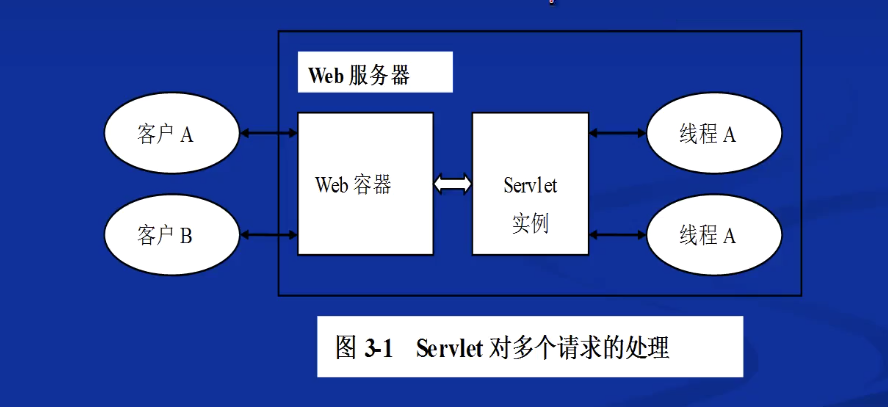
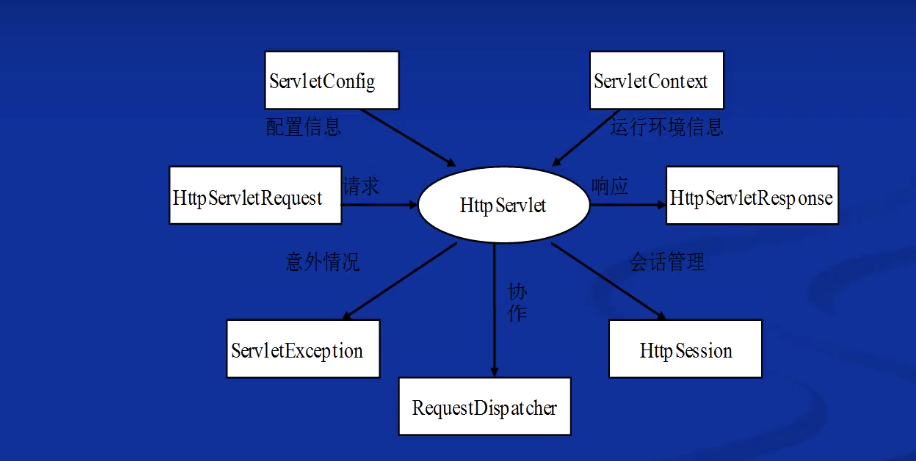

# 一. Servlet 编程
## Servlet 基础:

* 一种独立于操作系统平台和网络传输协议的服务器端的Java 应用程序，它用来扩展服务器的功能，可以生成动态的Web网页
* Servlet **不是**从*命令行*启动的，而是由包含Java虚拟机的**web服务器**进行加载的.
* **Servlet**与**Applet**相比较
	* 相似之处
		1. 他们不是独立的应用程序，没有main()方法
		2. 他们不是有用户调用，而是由另一个应用程序调用
		3. 他们都有一个生存周期，包含init()和destroy()方法
	* 不同之处
		1. Applet运行在客户端，有丰富的图形界面
		2. Servlet运行在服务端，没有图形界面

* Servlet 的工作原理
	* Servlet 运行在 **Web容器** ,Web容器负责管理Servlet

* Servlet基本工作流程
	1. 客户机将请求发送到服务器
	2. 服务器上的web容器实例化（装入）Servlet
	3. web容器将请求信息发送到 Servlet
	4. Servlet 创建一个响应，并将其返回到web容器
	5. web容器将响应发送到客户机
	6. 服务器关闭或Servlet 空闲时间超过一定限度时,调用destory()方法退出
* 多请求处理:为每一个请求创建一个新的线程来处理客户端的请求

	

* Servlet 编程接口

	

	* 其中**请求** 和 **响应** 是最重要的

# 二. Servlet 编程基本技能
## 1.编写响应HTTP请求的Servlet的步骤
	1. 创建一个扩展 `javax.servlet.http.HttpServlet` 接口的Servlet类
	2. 重写`doGet` 或 `doPost()` 方法实现对HTTP请求的动态响应

# 三. Servlet 编程高级技能

# 四. Servlet Filter 编程 

# 五. Servlet Listener 编程
