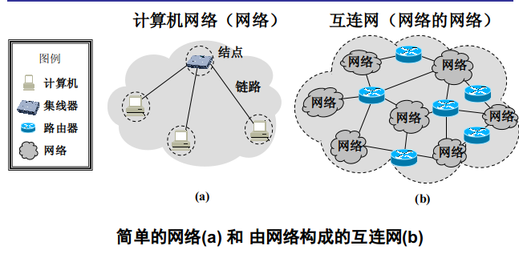
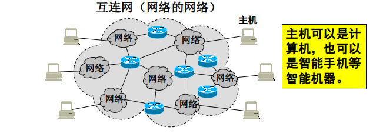
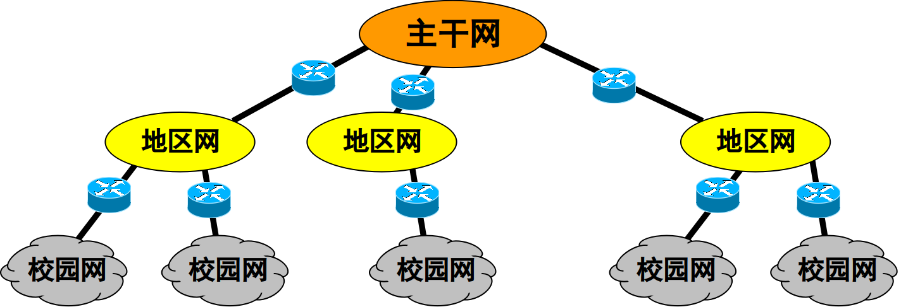
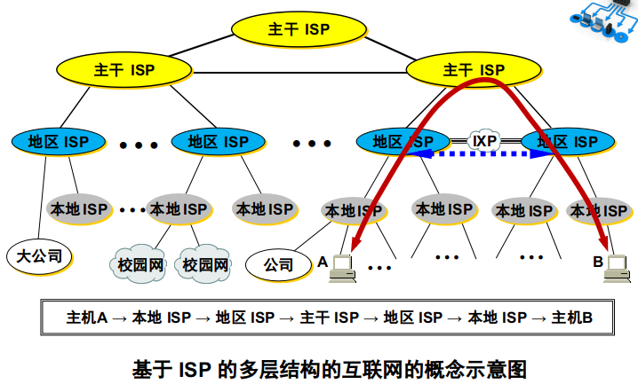
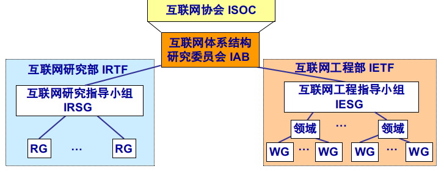
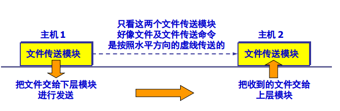
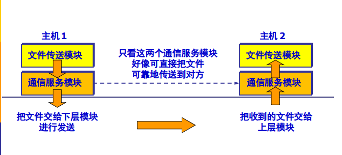
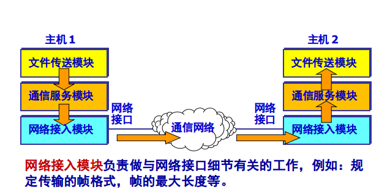
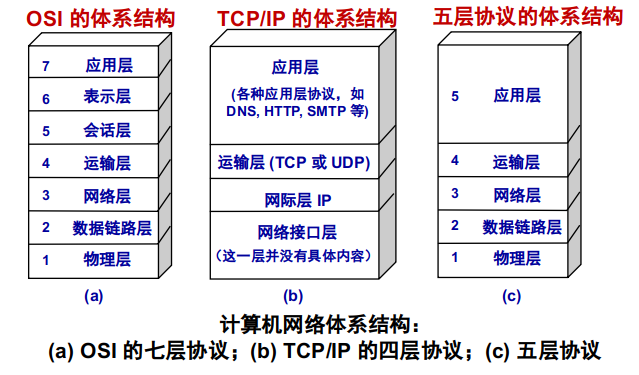

# 1.1 计算机网络在信息时代中的作用

* 21 世纪的一些重要特征是**数字化**、**网络化**和**信息化**，它是一个以**网络**为核心的信息时代。  
* 网络现在已经成为信息社会的命脉和发展知识经济的重要基础。  
* 大众熟悉的三大类网络有：
	1. ***电信网络***：提供电话、电报及传真等服务；  
	2. ***有线电视网络***：向用户传送各种电视节目；  
	3. ***计算机网络***：使用户能在计算机之间传送数据文件  
	* 发展最快且起到核心作用的是<u>**计算机网络**</u>

* 从理论上讲，可以把上述三种网络融合成一种网络就能够提供所有的上述服务，这就是很早以前就提出来的<u>**三网融合**</u>。
* 自从 20 世纪 90 年代以后，以 Internet 为代表的计算机网络得到了飞速的发展
* Internet 从教育科研网络（免费）**$\Longrightarrow$**: 商业网络: 商业网络
* Internet 中文译名：
	1. **因特网**：官方命名，但未长期推广  
	2. **互联网**: 目前最流行，事实上的标准译名  
* 互联网和互连网
	* **互连网**: 指在局部范围互联起来的网络  
	* **互联网**: 指当今世界上最大的计算机网络: *Internet*
* 互联网的两个重要特点
	* 连通性 (connectivity)
	* 共享 (Sharing)

		----------------------------------------------------

# 1.2 互联网概述

## 1.2.1 网络的网络

* **互联网 (Internet)**
	* 特指Internet，起源于美国，现已发展成为世界上最大的、覆盖全球的计算机网络。
* **计算机网络 (简称为网络)**
	* 由若干结点(node)和连接这些结点的链路(link)组成
* **互连网 (internetwork 或 internet)**
	* 可以通过路由器把网络互连起来，这就构成了一个覆盖范围更大的计算机网络，称之为互连网。
	* “网络的网络”(network of networks)。

		
* **名词"结点"和"节点"**
	* 在网络中， node 的标准译名是“结点”而不是“节点”
	* 虽然 node 有时也可译为“节点”，但这是指像天线上的驻波的节点，这种节点很像竹竿上的“节”
	* 数据结构的树 (tree) 中的 node 应当译为“节点”
	* **总结： 网络中用-> 结点； 数据结构中用-> 节点**

* **关于“云”**
	1. 云表示的网络已经包含了和网络相连的计算机。
	2. 云表示的网络里面就只剩下许多路由器和连接这些路由器的链路，把有关的计算机画在云的外面。习惯上，与网络相连的计算机常称为**主机 (host)**。

* **基本概要**
	* 网络把许多计算机连接在一起。
	* 互连网则把许多网络通过路由器连接在一起
	* 与网络相连的计算机常称为主机
	
	

## 1.2.2 互联网基础结构发展的三个阶段

### 第一阶段： 从单个网络ARPANET向互联网发展的过程
* 1983 年， TCP/IP 协议成为 ARPANET 上的标准协议，使得所有使用 TCP/IP 协议的计算机都能利用互连网相互通信。
* 人们把 1983 年作为因特网的诞生时间。
* 1990年，ARPANET正式宣布关闭

### 第二阶段： 建成了三级结构的互联网
* 它是一个三级计算机网络，分为主干网、地区网和校园网（或企业网）。

	

### 第三阶段： 逐渐形成了多层次IPS结构的互联网
* 出现了互联网服务提供者 ISP (Internet Service Provider)。
* 任何机构和个人只要向某个 ISP 交纳规定的费用，就可从该 ISP 获取所需 IP 地址的使用权，并可通过该 ISP 接入到互联网。
* 根据提供服务的覆盖面积大小以及所拥有的 IP 地址数目的不同，ISP 也分成为不同层次的 ISP：主干 ISP、地区 ISP 和 本地 ISP。

	

## 1.2.3 互联网的标准化工作
* 互联网的标准化工作对互联网的发展起到了非常重要的作用

* 互联网正式表转经过的三个阶段
	* 互联网草案 (Internet Draft) ——有效期只有六个月。在这个阶段还不是 RFC 文档。
	* 建议标准 (Proposed Standard) ——从这个阶段开始就成为 RFC 文档。
	* 互联网标准 (Internet Standard) ——达到正式标准后，每个标准就分配到一个编号 STD xx。 一个标准可以和多个 RFC 文档关联。

# 1.3 互联网的组成
## 1.3.1 互联网的边缘部分
1. **边缘部分**： 由所有连接在互联网上的主机组成。这部分是用户直接使用的，用来进行通信（传送数据、音频或视频）和资源共享。
2. **核心部分**：由大量网络和连接这些网络的路由器组成。这部分是为边缘部分提供服务的（提供连通性和交换）。

## 1.3.2 互联网的核心组成

# 1.4 计算机网络在我国的发展

# 1.5 计算机网络的类别

# 1.6 计算机网络的性能

----------------------------------

# 1.7 计算机网络的体系结构

## 1.7.1 计算机网络体系结构的形成
* 计算机网络是个非常复杂的系统。
* 相互通信的两个计算机系统必须**高度协调**工作才行，而这种“协调”是相当复杂的。
* **分层/分解**可将庞大而复杂的问题，转化为若干较小的局部问题，而这些较小的局部问题就比较易于研究和处理。 
* 1974年，美国的 IBM 公司宣布了系统网络体系结构SNA (System Network Architecture)。这个著名的网络标准就是按照分层的方法制定的
* **开放系统互连参考模型OSI/RM**
	* 为了使不同体系结构的计算机网络都能互连，国际标准化组织 ISO 于1977年成立了专门机构研究该问题。
	* 他们提出了一个试图使各种计算机在世界范围内互连成网的标准框架，即著名的开放系统互连基本参考模型 OSI/RM (Open Systems Interconnection Reference Model)，简称为 OSI。

* 两种国际标准
	* **OSI**: 法律上的 (de jure) 国际标准 OSI 并没有得到市场的认可。
	* **TCP/IP**: 非国际标准 TCP/IP 却获得了最广泛的应用。TCP/IP 常被称为**事实上的 (de facto) 国际标准**。

## 1.7.2 协议与划分层次
* 计算机网络中的数据交换必须遵守事先**约定好的规则**。
* 这些**规则**明确规定了所交换的数据的格式以及有关的同步问题（同步含有时序的意思）。
* **网络协议** (network protocol)，简称为协议，是为进行网络中的数据交换而建立的规则、标准或约定。
* 网络协议的三个组成要素
	1. **语法**：数据与控制信息的结构或格式 。
	2. **语义**：需要发出何种控制信息，完成何种动作以及做出何种响应。 
	3. **同步**：事件实现顺序的详细说明。
* 协议的两种形式： 1. 文字描述； 2. 程序代码
* 划分层次的概念举例
	* 主机1 向主机2 通过 网络 发送文件
	* 第一类工作与传输文件直接相关
		* 确信对方已做好接收和存储文件的准备。
		* 双方已协调好一致的文件格式。
	* 两个主机将**文件传送模块**作为最高的一层，剩下的工作由下面的模块负责

	* **两个主机交换文件**

	

	* **再设计一个通信服务模板**

	

	* **再设计一个网络接入模块**
	
	

* 分层的好处与缺点
	* 好处：
		* 各层之间是独立的
		* 灵活性好。
		* 结构上可分割开。
		* 易于实现和维护。
		* 能促进标准化工作
	* 缺点
		* 降低效率。
		* 有些功能会在不同的层次中重复出现，因而产生了额外开销。

* 分层要适量
	* 层数太少，就会使每一层的协议太复杂。
	* 分层太多, 又会在描述和综合各层功能的系统工程任务时遇到较多的困难。 

* 各层完成的主要功能
	1. **差错控制**：使相应层次对等方的通信更加可靠。
	2. **流量控制**：发送端的发送速率必须使接收端来得及接收，不要太快。
	3. **分段和重装**：发送端将要发送的数据块划分为更小的单位，在接收端将其还原。
	4. **复用和分用**：发送端几个高层会话复用一条低层的连接，在接收端再进行分用。
	5. **连接建立和释放**：交换数据前先建立一条逻辑连接，数据传送结束后释放连接。

* 计算机网络的体系结构
	* **计算机网络的体系结构** (architecture) 是计算机网络的各层及其协议的集合。
	* **体系结构**就是这个计算机网络及其部件所应完成的功能的精确定义。
	* **实现 (implementation)** 是遵循这种体系结构的前提下用何种硬件或软件完成这些功能的问题。
	* 体系结构是抽象的，而实现则是具体的，是真正在运行的计算机硬件和软件。

## 1.7.3 具有五层协议的体系结构

* 五种协议的体系结构
	* 应用层 (application layer) 
		* 提供各类应用： `FTP, SMTP, HTTP`
	* 运输层 (transport layer) 
		* 进程到进程的数据传输: `TCP, UDP`
	* 网络层 (network layer) 
		* 发送端到目的端的路由: `IP, OSPF，rip` 
	* 数据链路层 (data link layer) 
		* 临近网络元素的数据传输: `PPP, Ethernet`
	* 物理层 (physical layer) 
		*  “链路上”的数据位传输
			

## 1.7.4 实体、协议、服务和服务访问点

## 1.7.5 TCP/IP 的体系结构

:tada: :fireworks:
