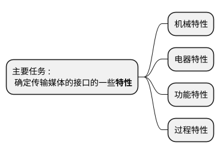
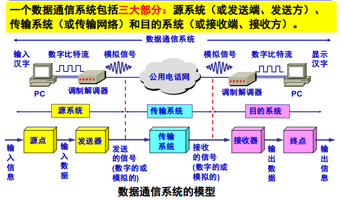

# 2.1 物理层的基本概念

* 物理层考虑的是**怎样**才能在连接各种计算机的传输媒体上**传输数据比特流**，而不是指具体的传输媒体。
* 物理层的作用是要尽可能地屏*蔽掉*不同传输媒体和通信手段的差异。
* 用于物理层的协议也常称为**规程**(procedure)

## 物理层的主要任务

1. **机械特性**：指明**接口**所用接线器的   <u>形状</u>、<u>尺寸</u>、<u>引脚数目</u>和<u>排列</u>、固定和锁定装着等
2. **电器特性**：指明接口电缆的各条线上出现的电压的范围(如：-5V到+5V)
3. **功能特性**：指明某条线上出现的某一电平的电压表示何种意义(如：-5V表示0，+5V表示1)
4. **过程特性**：指明对不通功能的各种可能事件的*出现顺序*

# 2.2 数据通信的基础知识

### 2.2.1 数据通信系统的模型

#### 常用术语:
* **数据(data)** : 运动消息的实体
* **信号(signal)**: 数据的电气的或电磁的表现
	1. <u>模拟信号</u>: 代表消息的参数的取值是**连续**的
	2. <u>数字信号</u>: 代表消息的参数的取值是**离散**的
* **码元(code)**: 在使用时间域（或简称为时域）的波形表示数字信号时，代表<u><b>不同离散数值</b></u>的基本波形。

### 2.2.2 有关信道的几个基本概念
* **信道**: 一般用来表示向某一个方向传送信息的媒体。
* **单向通信(单工通信)**: 只能有一个方向的通信而没有反方向的交互
* **双向交替通信(半双工通信)**: 通信的双方都可以发送信息，但不能双方同时发送(当然也就不能同时接收)。
* **双向同时通信(全双工通信)**: 通信的双方可以同时发送和接收信息。
* **调制分为两大类**
	1. **基带调制**
	2. **带通调制**
	3. **带通信号**

### 2.2.3 信道的极限容量

# 2.3 物理层下面的传输媒体

# 2.4 信道复用技术

# 2.5 数据传输技术

# 2.6 宽带接入技术

