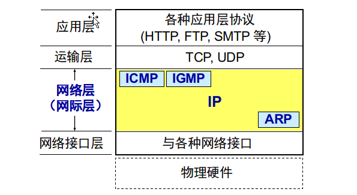

# 4.1 网络层提供的两种服务(可靠性由端系统负责)

## 1. 第一种观点: 让网络负责可靠交付
* 使用 **面向连接** 的通信方式
* 通信之前先建立 **虚电路(Virtual Circuit)** 以保证双发通信所需的一切网络资源
* 如果再使用可靠传输的网络协议，就可使所发送的分组**无差错**按序到达终点，**不丢失**、***不重复**。
* 虚电路: 
	* H1 发动到 H2 的所有分组都沿着同一条虚电路传输
	* 只是一条逻辑上的连接，分组到沿着这条逻辑连接按照存储转发方式传送
	* 不是建立了真正的链接

## 2. 第二种观点: 网络提供数据报服务 
* 互联网的先驱者提出了一种崭新的网络设计思路。
* 网络层向上只提供**简单灵活**的、**无连接的**、**尽最大努力交付**的数据报服务。
* 网络在发送分组时不需要先建立连接。每一个分组（即 IP 数据报）独立发送，与其前后的分组无关（不进行编号）。
* 网络层**不提供服务质量**的承诺。即所传送的分组可能出错、丢失、重复和失序（不按序到达终点），当然也不保证分组传送的时限。

## 二者对比

| 对比的方面                      | 虚拟电路服务(ATM..)                                 | 数据报服务(IP)                                            |
|---------------------------------|-----------------------------------------------------|-----------------------------------------------------------|
| 思路                            | 可靠的通信应当网络网络来保证                        | 可靠的通信应当由用户主机来保证                            |
| 连接的建立                      | 必须有                                              | 不需要                                                    |
| 终点地址                        | 仅在连接建立阶段使用， 每个分组使用短的虚电路号 | 每个分组都有终点的完整地址                                |
| 分组的转发                      | 属于同一条虚电路的分组 均按照同一路由器进行转发 | 每个分组独立选择路由进行转发                              |
| 当结点出故障时                  | 所有通过出故障的结点的虚电路均不能工作              | 出故障的结点可能会丢失分组， 一些路由器可能会发生变化 |
| 分组的顺序                      | 总是按照发送顺序到达终点                            | 到达终点时不一定按发送顺序                                |
| 端到端的差错处理 和流量控制 | 可以由网络负责，也可以由用户主机负责                | 由用户主机负责                                            |

# 4.2 网际协议 IP
## 4.2.1  虚拟互连网络
* 网络互联设备:
	* 中间设备又称为中间系统或中继(relay)系统
		* 物理层<u>中继</u>系统: **转发器(repeater)**
		* 数据链路层<u>中继</u>系统: **网桥或桥接器(bridge)**
		* 网络层<u>中继</u>系统: **路由器(router)**
		* 网络层以上的<u>中继</u>系统: **网关(gateway)** (由于历史原因： 许多文献将**路由器**称为**网关**)

* 网络互联的问题:
	* 不同的寻址方案
	* 不同的最大分组长度
	* 不同的网络接入机制
	* 不同的超时控制
	* 不同的差错恢复方法
	* 不同的状态报告方法
	* 不同的路由选择技术
	* 不同的用户接入控制
	* 不同的服务（面向连接服务和无连接服务）
	* 不同的管理与控制方式

* 虚拟互联网络的意义
	* 所谓**虚拟互连网络**也就是**逻辑互连网络**，它的意思就是互连起来的各种物理网络的异构性本来是客观存在的，但是我们利用 **IP 协议**就可以使这些性能各异的网络从用户看起来好像是一个统一的网络。
	* 使用 IP 协议的虚拟互连网络可简称为 **IP 网**。
	* 使用虚拟互连网络的好处是：当互联网上的主机进行通信时，就好像在**一个网络上**通信一样，而看不见互连的各具体的网络异构细节。
	* 如果在这种覆盖全球的 **IP 网**的上层使用 **TCP 协议**，那么就是现在的互联网 (Internet)。
* 网络层的四个协议**关系**: (IP, ICMP, IGMP ,ARP)

## 4.2.2  分类的 ip 地址

### 1.IP地址及表达方式

### 2.常用的三种类别的IP地址

##4.2.3  ip 地址与硬件地址

##4.2.4  地址解析协议 arp

##4.2.5  ip 数据报的格式

##4.2.6  ip 层转发分组的流程
