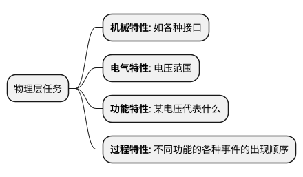
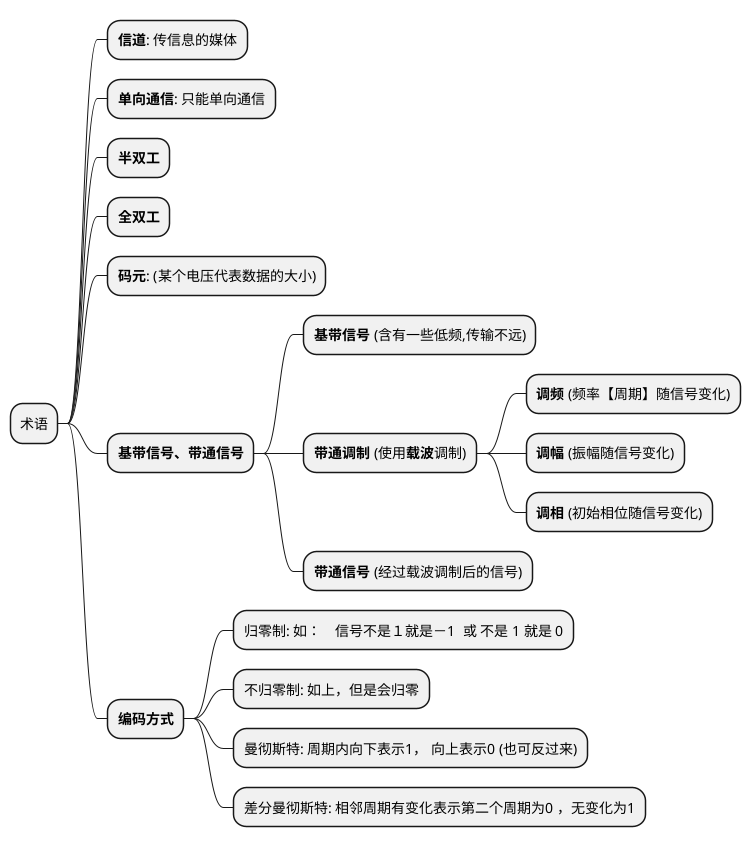
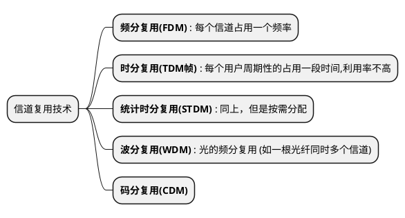
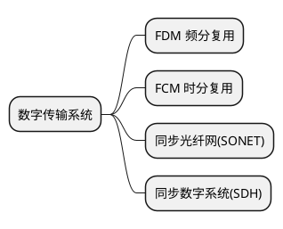
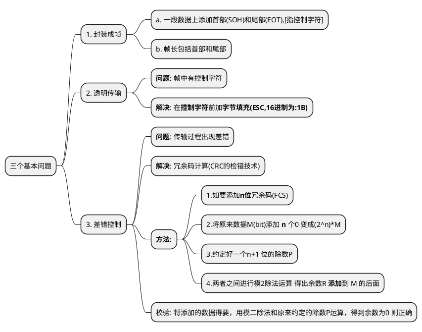
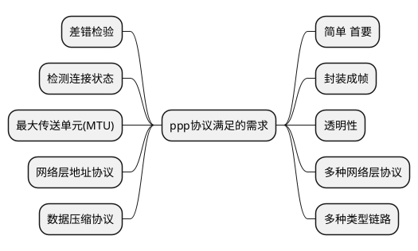
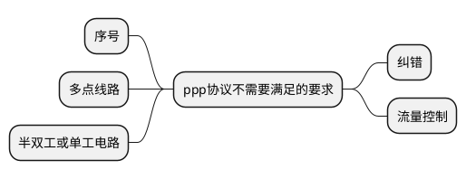
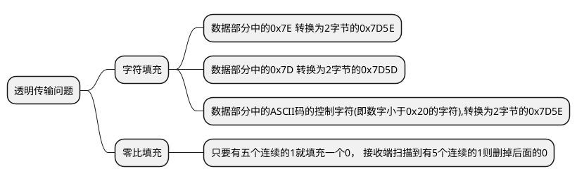
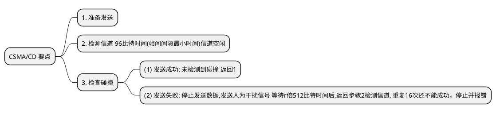

# 计算机网络概括笔记

## 第二章 物理层
### 2.1 基本概念
* 考虑的是传输媒体上的**比特流**，<u>不是</u>指具体**媒介**,  屏蔽不同媒介的差异
* 任务：　确定传输媒体接口特性

### 2.2 通信的基础知识
#### 2.2.1. 数据通信的系统模型
* 普通网线传输数字信号
* 远程网络通过模拟信号传输
* **源系统**: 源pc和调制解调器, **目的系统** 目的pc调制解调器
* 源点(源pc) -> 发送器(调制解调器) -> 传输系统 -> 接收器(调制解调器) -> 终点(目的pc)

#### 2.2.2. 常用术语:

#### 2.2.3. 信道的极限容量
* 实际信号的损失

##### 1. **信道能通过的频率范围**

##### 2. **信噪比**
* 噪声影响信号

**信噪比公式**
 $$信噪比(dB)=10\times\log_{10}(\frac{信号的平均功率}{噪声的平均功率} =\frac{S}{N})$$
* 如当$\frac{S}{N}=10$ 时 性噪比为10dB $\frac{S}{N}=1000$,信噪比为30dB

**香农公式**

$$C=W\times\log_{2}(1+\frac{S}{N}) \quad 或\quad  速率=带宽\times\log_{2}(1+\frac{信号平均功率}{高斯噪声功率})$$
* 各个字母意义
	* C 为信道极限传输速率
	* W 为信道带宽
	* S 为信道内信号的平均功率
	* N 为信道内部的高斯噪声功率

### 2.3 物理层下面的传输媒体
#### 2.3.1 引导型传输媒体
* 如网线，铜线， 光线
* 双绞线
* 同轴电缆
* 光缆
	* 多模光纤
	* 单模光纤
#### 2.3.2 非引导型传输媒体
* 无线
	* 短波
	* 微波

### 2.4 信道复用技术

### 2.5 数字传输系统

### 2.6 宽带接入技术
1. ADSL
2. 光纤同轴混合网(HFC网)

## 第三章 数据链路层
* 主机通过一个有一个路由传播

### 3.1 点对点的数据链路层
#### 3.1.1 数据链路和帧
* 链路： 物理层概念，直接相连的结点,不包括数据传输
* 数据链路:
	* 物理层添加协议,来传输数据
	* 以帧为单位传输数据

#### 3.1.2 三个基本问题

### 3.2 点对点协议 PPP

#### PPP协议的特点
* 点对点协议(用户到ISP就是点对点协议)
* 满足的需求

#### ppp协议的帧格式
* 帧格式: F[1byte], A[1byte], C[1byte],协议[2byte], 信息部分[不超过1500byte], FCS[2byte], F[1byte]
	* F 表示标志字段 值为0x7E
	* A 不起作用 为0xFF
	* C 表示控制字段 值通常为0x03
	* 协议中:(表示数据(信息部分)中的内容)
		* 0x0021: IP数据报
		* 0x8021: 网络控制数据
		* 0xC021: ppp链路控制数据
		* 0xC023: 鉴别数据

* 透明传输问题

#### PPP协议的工作状态
* ppp协议还包括网络层的东西

### 3.3 使用广播信道的数据链路层
#### 3.3.1 局域网的数据链路层
* 特点： 一个单位所有，有限使用
* 优点: 广播功能,方便扩展
* 拓扑结构: 星形(使用多),总线网,环形网
* 媒体共享:
	* 静态： 频分、十分、码分复用
	* 动态: 随机接入,受控接入
* 两个标准 :  DIX EthernetV2    和   IEEE 802.3

#### 3.3.2 CSMA/CD 协议
* 含义： 载波监听多点接入/碰撞检测
* 碰撞检测
	* 检测到碰撞，停止检测，一段随机时间后再次发送
	* 征用期 2倍端到端的时间
	* 检测到碰撞 在 0,1,3,7,(2^k-1) 时间中**随机**选择得到r ,其中K=Min[重传次数,10] 时间为r倍512比特时间
	* 10Mbit/s 征用期51.2us    可发送512bit = 64byte
	* 可发送人为干扰信号,让所有用户知道现在已经发生了碰撞

#### 3.3.3 使用集线器的星形拓扑
* 双绞线
* 10BASE-T
	* 10表示速率为10Mbit/s
	* BASE 表示基带
	* T 表示双绞线

#### 3.3.4 以太网的信道利用率
$$\alpha=\frac{\tau}{T_0}$$
* $\alpha$ 代表利用率
* $\tau$ 代表端到端的时间
* $T_0$ 代表所需时间

#### 3.3.5 以太网的MAC层
* 前24位 组织唯一标识符; 后24为扩展唯一标识符
* 单播，广播，多播
##### 帧格式

### 3.4 扩展的以太网
*

### 3.5 高速以太网

